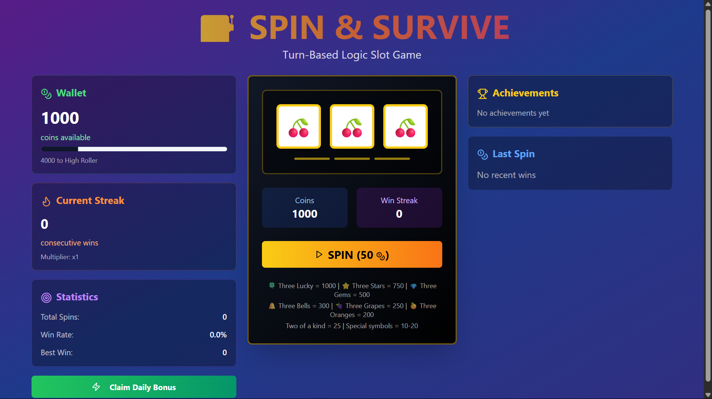

# Spin to Survive Slots

A modern, interactive slot machine game built with React and TypeScript. This project offers an engaging gaming experience with smooth animations and a beautiful user interface.

## 🎮 Features

- Interactive slot machine gameplay
- Modern and responsive UI design
- Smooth animations and transitions
- Real-time game state management
- Cross-browser compatibility

## 🛠️ Technologies

This project is built with a modern tech stack:

- **React 18** - For building the user interface
- **TypeScript** - For type-safe code
- **Vite** - For fast development and building
- **Tailwind CSS** - For styling
- **shadcn/ui** - For beautiful, accessible UI components
- **React Router** - For navigation
- **React Query** - For data fetching and state management
- **Zod** - For runtime type checking and validation

## 🚀 Getting Started

### Prerequisites

- Node.js (v16 or higher)
- npm or yarn package manager

### Installation

1. Clone the repository:

   ```bash
   git clone https://github.com/yourusername/spin-to-survive-slots.git
   cd spin-to-survive-slots
   ```

2. Install dependencies:

   ```bash
   npm install
   # or
   yarn install
   ```

3. Start the development server:

   ```bash
   npm run dev
   # or
   yarn dev
   ```

4. Open your browser and navigate to `http://localhost:5173`

## 📦 Available Scripts

- `npm run dev` - Start the development server
- `npm run build` - Build the project for production
- `npm run build:dev` - Build the project for development
- `npm run lint` - Run ESLint to check code quality
- `npm run preview` - Preview the production build locally

## 🏗️ Project Structure

```
src/
├── components/     # Reusable UI components
├── hooks/         # Custom React hooks
├── lib/           # Utility functions and configurations
├── pages/         # Page components
├── App.tsx        # Main application component
└── main.tsx       # Application entry point
```

## 📸 Screenshots

1. 🦁 Spin to Survive Game
   

## 🎨 UI Components

This project uses shadcn/ui, a collection of re-usable components built with Radix UI and Tailwind CSS. The components are highly customizable and accessible.

## 🔧 Development

The project uses ESLint for code linting and TypeScript for type checking. Make sure to follow the established code style and best practices when contributing.

## 📝 License

This project is licensed under the MIT License - see the LICENSE file for details.

## 🤝 Contributing

Contributions, issues, and feature requests are welcome! Feel free to check the issues page.

1. Fork the project
2. Create your feature branch (`git checkout -b feature/AmazingFeature`)
3. Commit your changes (`git commit -m 'Add some AmazingFeature'`)
4. Push to the branch (`git push origin feature/AmazingFeature`)
5. Open a Pull Request

## 📧 Contact

For any questions or suggestions, please open an issue in the repository.
